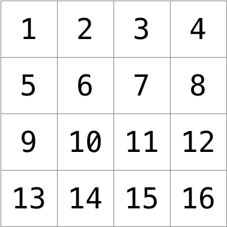

# Image Converter Filter

Simple image converter from JPG to other formats and principaly apply filters to images


### How to run?
Just after downloading the file, execute:
```bash
make
```
then
```bash
./image_filter
```


## Background explanation an technical overview
So, this week on my classes of multimedia systems and computer graphics, we started on images, filters, how images are represented, encoded and the process of filters of images and lightning.
So I got curious about the subject, and started looking up on it, the process behind converting images, encoding them in diferent formats, what they represent and the algorithms that are used to create diferent filters.

## Pixels
Pixels are squares, individual dots, of color that are arranged on an up-down, left-right grid.
You can imagine an image as a map of bits, where zeros represent black and ones represent white.


## How Images Are Represented in Different Color Models
Images are stored as a grid of pixels, where each pixel contains color information. The way colors are stored depends on the color model used.

### RGB
Each pixel has 3 color channels (Red, Green, Blue) and the values range from 0 to 255 (8 bits per channel).
By example (255, 0, 0) is Pure red, (0, 255, 0) is Pure gree, (0, 0, 255) is Pure blue, (255, 255, 255) goes White and (0, 0, 0) refers to Black.


### RGBA (RGB + Alpha) Transparency Support
Is the same as RGB but adds an alpha channel for transparency.
By example the (255, 0, 0, 128) is a Semi-transparent red.
Commonly used in PNG and some BMP formats.


### Grayscale – No Colors, Only Brightness
Stores only the brightness of a image;
Its only 1 channel, since just the brightness level (0 = black, 255 = white). A 128 could represent by example a Medium gray.


### CMYK (Cyan, Magenta, Yellow, Black) – Used in Printing
Unlike RGB (additive model), CMYK is subtractive where each pixel has 4 channels: C, M, Y, K. 

Is the one used in printers because it just better represents ink mixing. A pure red could be represented like (0, 100, 100, 0) and (100, 0, 100, 0) a Pure green


## Technical Overview of Image Formats & Encoding
Images are stored in different formats based on how they encode pixel data, compression, and metadata, here are the formats on the program (the compression and actual deconding and convertion are handled by the stb_image wich is a great starting point. It allows us to easily load and save images without too much complexity):

### JPG (JPEG) – Lossy Compression, Optimized for Photos
Is the more common and the main one of this program, it uses Discrete Cosine Transform (DCT) to convert image blocks (8×8 pixels) into frequency components.

It Removes high-frequency details (small variations in color) to reduce file size and then the Huffman coding for additional compression.

🔹 The File Structure is the above:
```
[Header] [Huffman Tables] [Quantization Tables] [Compressed Image Data]
```

### PNG – Lossless Compression, Supports Transparency
This one (also used a lot) uses Deflate compression (LZ77 + Huffman coding) wich basically means No data loss.

It stores pixels as RGB or RGBA (with an alpha channel) and uses filtering before compression to reduce redundancy between pixels. It Supports palette-based images (indexed colors) for better compression in simple graphics.

🔹 It stores data in the above file Structure:
```
[Header] [Chunks (IHDR, PLTE, IDAT)] [CRC Checksums]
```

### BMP – Uncompressed, Raw Pixel Storage
It stores pixels in RGB or RGBA format, row by row with no compression. 
Is simple format, easy to manipulate but results in huge file sizes of course.

Is the one I used to manipulate and create all the filters.

🔹 The file structure is:
```
[Header] [DIB Header] [Color Table] [Pixel Data]
```

## Manipulating a Bitmap
A **24-bit BMP** file consists of a structured sequence of bytes that include metadata and pixel data. The file begins with two headers: the **BITMAPFILEHEADER**, which is 14 bytes long and contains information such as the file size and the offset where pixel data starts, and the **BITMAPINFOHEADER**, which is 40 bytes long and defines essential properties like the image’s width, height, and color depth. In a 24-bit BMP, each pixel is represented by three bytes, corresponding to the **Blue, Green, and Red** (BGR) color channels.

Pixel data is stored from the bottom row to the top row, with each row written from left to right. Because BMP requires that each row’s size be a multiple of four bytes, extra padding bytes may be added at the end of each row to satisfy this requirement. This padding must be accounted for when reading or writing BMP files.

To manipulate a BMP in C++, the process involves reading the headers to extract image dimensions, allocating memory to store pixel data, and then modifying pixel values as needed. Once modifications are complete, the updated pixel data, along with the original headers, is written back to a new BMP file. This structure makes BMP an easy format for direct pixel manipulation, making it the best (at least in my expirience) for applying filters or transformations.

## Image filtering
What does it even mean to filter an image? You can think of filtering an image as taking the pixels of some original image, and modifying each pixel in such a way that a particular effect is apparent in the resulting image, See by yourself by the filters I've applied in the program.

### Sepia Filter (Vintage Effect)

The sepia filter transforms an image into a warm, brownish tone by adjusting the RGB values based on a specific weighted formula. 

Each pixel is recalculated using a mix of its original red, green, and blue values. The red channel gets the highest influence from red and green, the green channel is influenced by all three colors with medium weight, and the blue channel gets the least contribution. 

Since these transformations can sometimes result in values exceeding the maximum possible value of 255, any value above this threshold must be clamped to ensure valid color representation. After computing the new values, the original pixel is updated with the sepia-toned colors.

```cpp
void sepia(rgbt** image, int width, int height) {
    for(int i = 0; i < height; ++i)
    {
        for(int j = 0; j < width; ++j)
        {
           int originalRed = image[i][j].rgbtRed;
           int originalGreen = image[i][j].rgbtGreen;
           int originalBlue = image[i][j].rgbtBlue;

           int sepiaRed = round(.393 * originalRed + .769 * originalGreen + .189 * originalBlue);
           int sepiaGreen = round(.349 * originalRed + .686 * originalGreen + .168 * originalBlue);
           int sepiaBlue = round(.272 * originalRed + .534 * originalGreen + .131 * originalBlue);

           image[i][j].rgbtRed = (sepiaRed > 255) ? 255 : sepiaRed;
           image[i][j].rgbtGreen = (sepiaGreen > 255) ? 255 : sepiaGreen;
           image[i][j].rgbtBlue = (sepiaBlue > 255) ? 255 : sepiaBlue;
        }
    }
}
```

### Grayscale Filter (Black & White Effect)

Grayscale conversion removes all color information by setting the red, green, and blue channels of each pixel to the same brightness value. 

This value is calculated by averaging the three original color components. Since human vision perceives green more strongly than red or blue, weighted formulas can also be used to improve the accuracy of grayscale conversion, but a simple average works well for basic applications.

After computing this brightness value, the pixel’s RGB components are all set to the same value, resulting in a monochromatic image where variations in brightness define the structure rather than color.

```cpp
void grayscale(rgbt** image, int width, int height) {

    for (int i = 0; i < height; ++i)
    {
        for(int j = 0; j < width; ++j)
        {
            int average = round((image[i][j].rgbtBlue + image[i][j].rgbtGreen + image[i][j].rgbtRed) / 3.0);

            image[i][j].rgbtBlue = average;
            image[i][j].rgbtGreen = average;
            image[i][j].rgbtRed = average;
        }
    }
}
```

### Reflection (Horizontal Flip)
To reflect an image horizontally, each row of pixels needs to be reversed. This means swapping the leftmost pixel with the rightmost one, the second pixel with the second-to-last, and so on until reaching the middle of the row.

 The process is performed for each row in the image, ensuring that all pixels are mirrored across the vertical axis. Since swapping involves modifying pixel positions rather than their values, no new color calculations are needed. 
 
 This transformation creates a mirrored effect, making objects appear flipped as if seen through a reflection.

```cpp
void reflect(rgbt** image, int width, int height)
{
    for (int i = 0; i < height; ++i)
    { 
        for (int j = 0, m = width - 1; j < width / 2; ++j, --m)
        {
            rgbt temp = image[i][j];
            image[i][j] = image[i][m];
            image[i][m] = temp;
        }
    }
    return;
}
```

### Blur Filter (Smoothing Effect)
Blurring softens an image by averaging the colors of a pixel and its neighbors, creating a smooth and blended effect. Each pixel's new value is determined by computing the average of all pixels within a 3×3 grid centered around it.



For pixels near the edges, where some neighbors do not exist, only the valid surrounding pixels are considered in the calculation. To avoid modifying pixels while they are still being used for calculations, a copy of the original image is created.

Once all new pixel values are computed, the original image is updated with the blurred colors, reducing sharp transitions between pixels and creating a softer look.

```cpp
void blur(rgbt** image, int width, int height) {
    
    rgbt** copy = new rgbt*[height];
    for (int i = 0; i < height; ++i) {
        copy[i] = new rgbt[width];
        for (int j = 0; j < width; ++j) {
            copy[i][j] = image[i][j];
        }
    }

    for (int i = 0; i < height; ++i) {
        for (int j = 0; j < width; ++j) {
            float Red = 0, Green = 0, Blue = 0;
            int counter = 0;

            for (int li = -1; li <= 1; ++li) {
                for (int lj = -1; lj <= 1; ++lj) {
                    int ni = i + li;
                    int nj = j + lj;

                    if (ni >= 0 && ni < height && nj >= 0 && nj < width) {
                        Red += copy[ni][nj].rgbtRed;
                        Green += copy[ni][nj].rgbtGreen;
                        Blue += copy[ni][nj].rgbtBlue;
                        counter++;
                    }
                }
            }

            image[i][j].rgbtRed = round(Red / counter);
            image[i][j].rgbtGreen = round(Green / counter);
            image[i][j].rgbtBlue = round(Blue / counter);
        }
    }

    
    for (int i = 0; i < height; ++i) {
        delete[] copy[i];
    }
    delete[] copy;
}
```

### Edge Detection (Sharpening Effect)

Edge detection highlights the boundaries of objects in an image by identifying areas of sharp color change. This is done using the Sobel operator, which consists of two matrices: one for detecting horizontal edges and another for vertical edges.


Each pixel’s new color is computed by applying these matrices to its surrounding pixels, multiplying each neighboring value by a corresponding weight from the matrices. The results from the horizontal and vertical calculations are then combined using the Pythagorean theorem to determine the final intensity of the edge. 

If the computed value exceeds 255, it is clamped to ensure a valid color range. Since this transformation relies on neighboring pixels, a copy of the image is used to preserve original values during calculations. 

The resulting image contains bright edges where significant changes occur and dark regions where the image remains uniform.

```cpp
void edge(rgbt** image, int width, int height) {
    int gx[3][3] = {{-1, 0, 1}, {-2, 0, 2}, {-1, 0, 1}};
    int gy[3][3] = {{-1, -2, -1}, {0, 0, 0}, {1, 2, 1}};

    rgbt** copy = new rgbt*[height];
    for (int i = 0; i < height; ++i) {
        copy[i] = new rgbt[width];
        for (int j = 0; j < width; ++j) {
            copy[i][j] = image[i][j];
        }
    }

    for (int i = 0; i < height; ++i) {
        for (int j = 0; j < width; ++j) {
            int redX = 0, greenX = 0, blueX = 0;
            int redY = 0, greenY = 0, blueY = 0;

            for (int li = -1; li <= 1; ++li) {
                for (int lj = -1; lj <= 1; ++lj) {
                    int ni = i + li;
                    int nj = j + lj;

                    if (ni >= 0 && ni < height && nj >= 0 && nj < width) {
                        redX += copy[ni][nj].rgbtRed * gx[li + 1][lj + 1];
                        greenX += copy[ni][nj].rgbtGreen * gx[li + 1][lj + 1];
                        blueX += copy[ni][nj].rgbtBlue * gx[li + 1][lj + 1];

                        redY += copy[ni][nj].rgbtRed * gy[li + 1][lj + 1];
                        greenY += copy[ni][nj].rgbtGreen * gy[li + 1][lj + 1];
                        blueY += copy[ni][nj].rgbtBlue * gy[li + 1][lj + 1];
                    }
                }
            }

            int red = round(sqrt(redX * redX + redY * redY));
            int green = round(sqrt(greenX * greenX + greenY * greenY));
            int blue = round(sqrt(blueX * blueX + blueY * blueY));

            image[i][j].rgbtRed = (red > 255) ? 255 : red;
            image[i][j].rgbtGreen = (green > 255) ? 255 : green;
            image[i][j].rgbtBlue = (blue > 255) ? 255 : blue;
        }
    }

    for (int i = 0; i < height; ++i) {
        delete[] copy[i];
    }
    delete[] copy;
}
```

## Conclusion

This project demonstrates the fundamentals of image processing and filtering using C++. By leveraging the `stb_image` and `stb_image_write` libraries, we were able to load, manipulate, and save images in various formats with minimal complexity. The implementation of filters such as sepia, grayscale, blur, reflection, and edge detection showcases how mathematical operations on pixel data can produce visually striking effects.

Through this project, I gained a deeper understanding of  how filters can be applied to transform image with dynamic memory management, matrix operations, and the importance of efficient algorithms in multimedia applications.

This program is a great starting point for anyone interested in exploring the world of image processing. It can be extended further by adding more advanced filters, supporting additional image formats, or optimizing performance for larger images.

Thank you for taking the time to explore this project. I hope it inspires you to dive deeper into the fascinating field of computer graphics and multimedia systems!

---

Here are some ideas for future enhancements you cand do to this project:
1. **Add More Filters**: Implement additional filters such as sharpening, embossing, or custom artistic effects.

2. **Support More Formats**: Extend support to other image formats like GIF, TIFF, or WebP.

3. **Command-Line Arguments**: Allow users to specify input/output files and filters directly via command-line arguments for a more streamlined experience.

4. **Multithreading**: Optimize performance by parallelizing filter operations for large images.

5. **GUI Integration**: Create a graphical user interface (GUI) for easier interaction and visualization of filter effects.

6. **Real-Time Processing**: Explore real-time image processing using video streams or webcam input.


## Acknowledgments

- **stb_image and stb_image_write**: These libraries by Sean Barrett made it easy to handle image loading and saving without worrying about the complexities of image format decoding and encoding.
- **CS50**: The foundational concepts of image processing and filters were inspired by the CS50 course, which provided a great introduction to multimedia systems and computer graphics.

## How to Contribute

If you'd like to contribute to this project, feel free to fork the repository and submit a pull request. Whether it's fixing bugs, adding new features, or improving documentation, your contributions are welcome!


